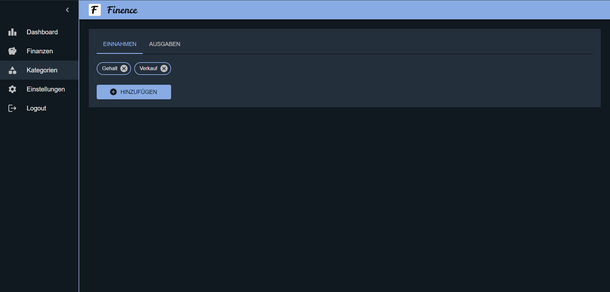
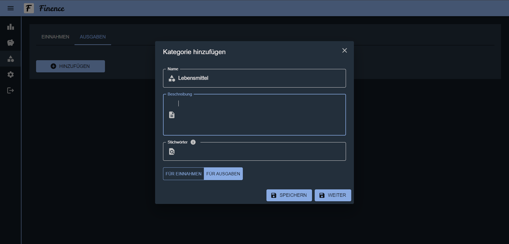
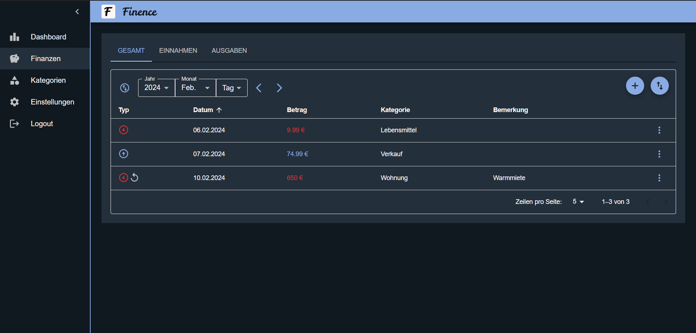
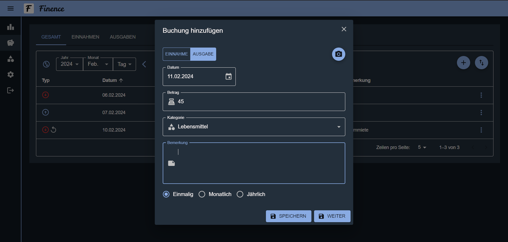
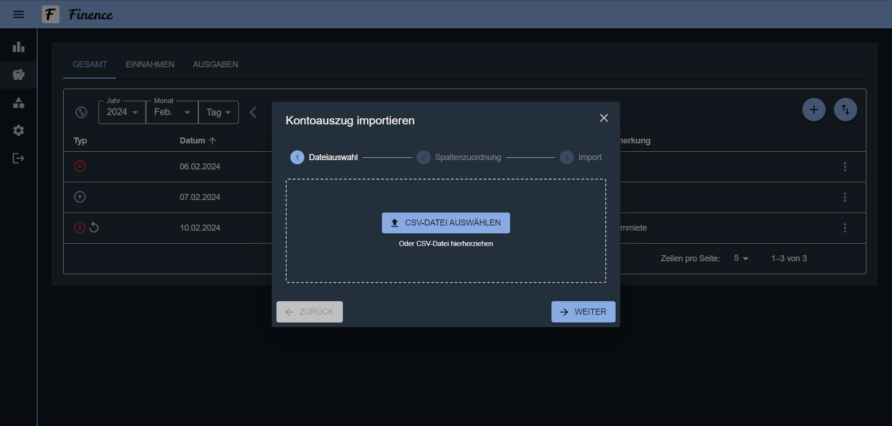
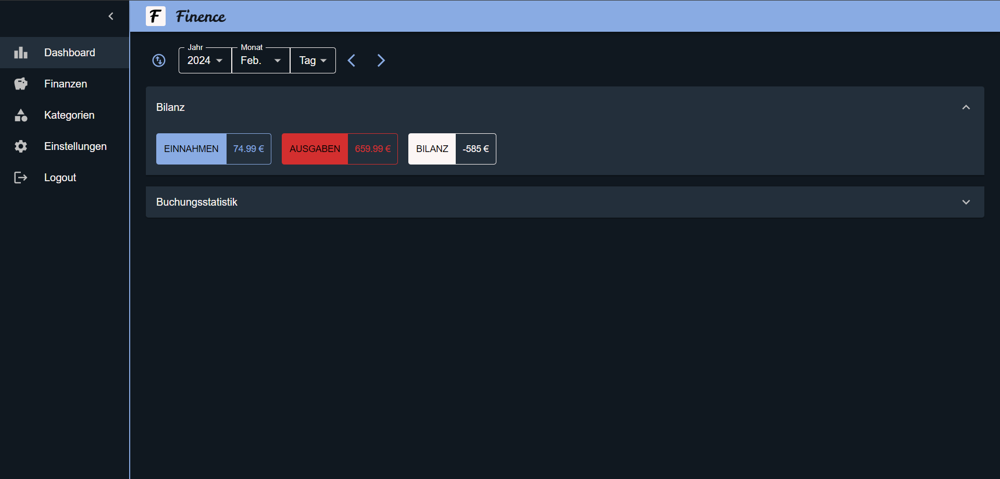
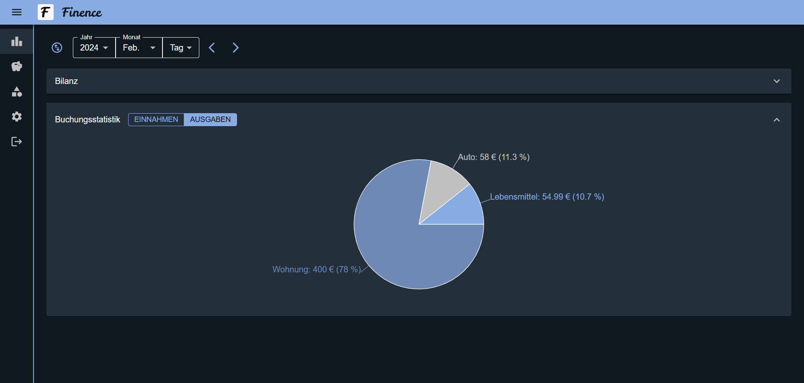

# Finence

Webapp zum Tracken und Auswerten von Finanzen.

## Screenshots

_Kategorien_

_Kategorie hinzufügen_

_Buchungen_

_Buchung hinzufügen_

_Kontoauszug importieren_

_Bilanz_

_Buchungsstatistik_

## Ausführung

### Backend

1. [.env.draft-Datei](./server/.env.draft) kopieren und Werte setzen
2. [start_server.sh](./dev/start_server.sh) ausführen oder Flask App und Datenbank selbstständig starten

### Frontend

1. [.env.draft-Datei](./client/.env.draft) kopieren und Werte setzen
2. [start_client.sh](./dev/start_server.sh) ausführen oder React App selbstständig starten
3. [http://localhost:1234](http://localhost:1234) in einem Browser aufrufen

## Zukünftige Features

- „Passwort vergessen“
- Performance-Diagramm bzgl. Entwicklung der Einnahmen, Ausgaben und Bilanz in einem ausgewählten Zeitraum
- Responsive Design

## Verwendete Software

### Client

<table>
  <tr>
    <td><a href="https://github.com/microsoft/TypeScript">TypeScript</a></td>
    <td>von <a href="https://github.com/microsoft">Microsoft</a></td>
    <td>lizenziert mit <a href="https://github.com/microsoft/TypeScript/blob/main/LICENSE.txt">Apache License 2.0</a></td>
  </tr>
  <tr>
    <td><a href="https://github.com/facebook/react">React</a></td>
    <td>von <a href="https://github.com/facebook">Meta</a></td>
    <td>lizenziert mit <a href="https://github.com/facebook/react/blob/main/LICENSE">MIT License</a></td>
  </tr>
  <tr>
    <td><a href="https://github.com/reduxjs/redux">Redux</a></td>
    <td>von <a href="https://github.com/reduxjs">Redux</a></td>
    <td>lizenziert mit <a href="https://github.com/reduxjs/redux/blob/master/LICENSE.md">MIT License</a></td>
  </tr>
  <tr>
    <td><a href="https://github.com/parcel-bundler/parcel">Parcel</a></td>
    <td>von <a href="https://github.com/parcel-bundler">Parcel</a></td>
    <td>lizenziert mit <a href="https://github.com/parcel-bundler/parcel/blob/v2/LICENSE">MIT License</a></td>
  </tr>
  <tr>
    <td><a href="https://github.com/mui/material-ui">MUI</a></td>
    <td>von <a href="https://github.com/mui">MUI</a></td>
    <td>lizenziert mit <a href="https://github.com/mui/material-ui/blob/master/LICENSE">MIT License</a></td>
  </tr>
  <tr>
    <td><a href="https://github.com/axios/axios#axios-api">axios</a></td>
    <td>von <a href="https://github.com/axios">axios</a></td>
    <td>lizenziert mit <a href="https://github.com/axios/axios/blob/v1.x/LICENSE">MIT License</a></td>
  </tr>
  <tr>
    <td><a href="https://github.com/colinhacks/zod">Zod</a></td>
    <td>von <a href="https://github.com/colinhacks">colinhacks</a></td>
    <td>lizenziert mit <a href="https://github.com/colinhacks/zod/blob/master/LICENSE">MIT License</a></td>
  </tr>
  <tr>
    <td><a href="https://github.com/eslint/eslint">ESLint</a></td>
    <td>von <a href="https://github.com/eslint">ESLint</a></td>
    <td>lizenziert mit <a href="https://github.com/eslint/eslint/blob/main/LICENSE">MIT License</a></td>
  </tr>
  <tr>
    <td><a href="https://github.com/prettier/prettier">Prettier</a></td>
    <td>von <a href="https://github.com/prettier">Prettier</a></td>
    <td>lizenziert mit <a href="https://github.com/prettier/prettier/blob/main/LICENSE">MIT License</a></td>
  </tr>
  <tr>
    <td><a href="https://github.com/moment/moment">Moment.js</a></td>
    <td>von <a href="https://github.com/moment">Moment.js</a></td>
    <td>lizenziert mit <a href="https://github.com/moment/moment/blob/develop/LICENSE">MIT License</a></td>
  </tr>
   <tr>
    <td><a href="https://github.com/recharts/recharts">Recharts</a></td>
    <td>von <a href="https://github.com/recharts">recharts</a></td>
    <td>lizenziert mit <a href="https://github.com/recharts/recharts/blob/3.x/LICENSE">MIT License</a></td>
  </tr>
  <tr>
    <td><a href="https://github.com/motdotla/dotenv">dotenv</a></td>
    <td>von <a href="https://github.com/motdotla">motdotla</a></td>
    <td>lizenziert mit <a href="https://github.com/motdotla/dotenv/blob/master/LICENSE">BSD 2-Clause "Simplified" License</a></td>
  </tr>
</table>

### Server

<table>
  <tr>
    <td><a href="https://github.com/python/cpython">Python</a></td>
    <td>von <a href="https://github.com/python">Python</a></td>
    <td><a href="https://github.com/python/cpython/blob/main/LICENSE">Lizenz</a></td>
  </tr>
  <tr>
    <td><a href="https://github.com/pallets/flask">Flask</a></td>
    <td>von <a href="https://github.com/pallets">Pallets</a></td>
    <td>lizenziert mit <a href="https://github.com/pallets/flask/blob/main/LICENSE.rst">BSD 3-Clause "New" or "Revised" License</a></td>
  </tr>
  <tr>
    <td><a href="https://github.com/sqlalchemy/sqlalchemy">SQLAlchemy</a></td>
    <td>von <a href="https://github.com/sqlalchemy">SQLAlchemy</a></td>
    <td>lizenziert mit <a href="https://github.com/sqlalchemy/sqlalchemy/blob/main/LICENSE">MIT License</a></td>
  </tr>
  <tr>
    <td><a href="https://github.com/redis/redis-py">redis-py</a></td>
    <td>von <a href="https://github.com/redis">Redis</a></td>
    <td>lizenziert mit <a href="https://github.com/redis/redis-py/blob/master/LICENSE">MIT License</a></td>
  </tr>
  <tr>
    <td><a href="https://github.com/madmaze/pytesseract">Python Tesseract</a></td>
    <td>von <a href="https://github.com/madmaze">madmaze</a></td>
    <td>lizenziert mit <a href="https://github.com/madmaze/pytesseract/blob/master/LICENSE">Apache License 2.0</a></td>
  </tr>
  <tr>
    <td><a href="https://github.com/dbader/schedule">schedule</a></td>
    <td>von <a href="https://github.com/dbader">dbader</a></td>
    <td>lizenziert mit <a href="https://github.com/dbader/schedule/blob/master/LICENSE.txt">MIT License</a></td>
  </tr>
  <tr>
    <td><a href="https://github.com/VirusTotal/vt-py">vt-py</a></td>
    <td>von <a href="https://github.com/VirusTotal">VirusTotal</a></td>
    <td>lizenziert mit <a href="https://github.com/VirusTotal/vt-py/blob/master/LICENSE">Apache License 2.0</a></td>
  </tr>
  <tr>
    <td><a href="https://github.com/pallets/werkzeug">Werkzeug</a></td>
    <td>von <a href="https://github.com/pallets">Pallets</a></td>
    <td>lizenziert mit <a href="https://github.com/pallets/werkzeug/blob/main/LICENSE.rst">BSD 3-Clause "New" or "Revised" License</a></td>
  </tr>
  <tr>
    <td><a href="https://github.com/theskumar/python-dotenv">python-dotenv</a></td>
    <td>von <a href="https://github.com/theskumar">theskumar</a></td>
    <td>lizenziert mit <a href="https://github.com/theskumar/python-dotenv/blob/main/LICENSE">BSD 3-Clause "New" or "Revised" License</a></td>
  </tr>
</table>
